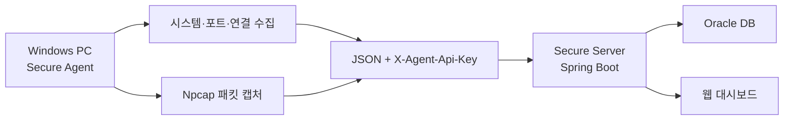
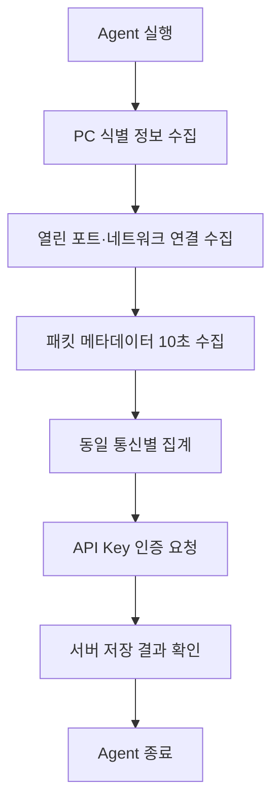

# Secure Agent

Windows PC의 시스템·네트워크 상태를 수집하고, 인증된 API 요청으로 Secure Server에 전송하는 경량 보안 에이전트입니다.


> Secure Agent는 패킷 원문을 저장하는 프로그램이 아닙니다.  
> 시스템 정보, 열린 포트, 네트워크 연결, 통신 메타데이터만 수집하며 비밀번호·쿠키·인증 토큰·HTTP 본문은 수집하거나 전송하지 않습니다.

## 프로젝트 개요

Secure Agent는 Windows 엔드포인트에서 보안 점검에 필요한 최소 정보를 수집한 뒤 Secure Server의 REST API로 전송합니다. 서버는 수신 데이터를 Oracle DB에 저장하고 웹 화면에서 컴퓨터별 상태를 조회할 수 있게 합니다.

에이전트는 한 번 실행될 때 다음 작업을 순서대로 수행한 후 종료됩니다.

1. PC 및 운영체제 정보 수집
2. 열린 포트와 프로세스 정보 수집
3. 현재 네트워크 연결 정보 수집
4. 10초 동안 TCP/UDP 패킷 메타데이터 수집
5. 동일 통신 단위로 메타데이터 집계
6. API Key가 포함된 요청으로 서버에 전송

## 주요 기능

| 기능 | 설명 |
|---|---|
| 시스템 정보 수집 | 컴퓨터 이름, 운영체제, 운영체제 버전, 사용자 이름 수집 |
| 열린 포트 분석 | 로컬 주소·포트, PID, 프로세스 이름 등 수집 |
| 네트워크 연결 분석 | 프로토콜, 로컬·원격 주소와 포트, 연결 상태, 프로세스 정보 수집 |
| 패킷 메타데이터 수집 | Npcap과 Pcap4J로 TCP/UDP 통신을 제한된 시간 동안 수집 |
| 통신 단위 집계 | 동일 연결의 패킷 수, 총 바이트, 최초·마지막 관측 시각 집계 |
| 응용 프로토콜 식별 | DNS, HTTP, HTTPS, 기타 통신으로 구분 |
| 도메인 정보 추출 | DNS 질의 도메인, HTTP Host, TLS ClientHello의 SNI 추출 |
| 방향 판별 | 현재 PC 기준으로 `INBOUND`와 `OUTBOUND` 구분 |
| 외부 통신 판별 | 상대 IP가 외부 공인 IP인지 `externalYn`으로 표시 |
| 인증 전송 | `X-Agent-Api-Key` 헤더를 사용해 Agent 전용 API 인증 |
| 개인정보 최소화 | 패킷 원문과 민감한 본문 대신 필요한 메타데이터만 전송 |

## 전체 구조



## 데이터 처리 흐름



Secure Agent는 상시 실행 서비스가 아니라 **수집 → 전송 → 종료** 방식의 단발 실행 프로그램입니다. 주기 수집이 필요하면 Windows 작업 스케줄러에서 실행 주기를 설정할 수 있습니다.

## 수집 데이터

### 시스템 정보

- 컴퓨터 이름
- 운영체제 이름과 버전
- 현재 사용자 이름

### 열린 포트

- 프로토콜
- 로컬 주소와 포트
- PID
- 프로세스 이름

### 네트워크 연결

- 프로토콜
- 로컬·원격 주소와 포트
- 연결 상태
- PID와 프로세스 이름

### 패킷 메타데이터

- TCP 또는 UDP
- DNS, HTTP, HTTPS, OTHER
- 송신·수신 방향
- 로컬·원격 IP와 포트
- 패킷 수와 총 바이트
- 최초·마지막 관측 시각
- 외부 통신 여부
- DNS 질의 도메인
- HTTP Host
- TLS SNI

## 보안 및 개인정보 보호 설계

### 1. API Key를 소스코드와 분리

실제 API Key는 Java 코드나 Git 저장소에 넣지 않고 `SECURE_AGENT_API_KEY` 환경변수로 전달합니다.

```powershell
$env:SECURE_AGENT_API_KEY = 'CHANGE_ME_AGENT_API_KEY'
```

Agent는 모든 데이터 전송 요청에 다음 헤더를 포함합니다.

```http
X-Agent-Api-Key: <환경변수에서 읽은 API Key>
```

따라서 웹 사용자의 로그인 인증과 Agent 프로그램의 API 인증을 분리할 수 있습니다.

### 2. 서버 주소를 환경변수로 분리

`SECURE_SERVER_BASE_URL`을 사용하므로 소스코드를 다시 수정하지 않고 로컬 서버, 사설망 서버, HTTPS 터널 주소로 전환할 수 있습니다.

### 3. 패킷 원문 미저장

Secure Agent는 다음 정보를 저장하거나 서버에 전송하지 않습니다.

- 패킷 원문
- 비밀번호
- 쿠키
- 인증 토큰
- HTTP 요청·응답 본문
- 파일 내용

### 4. 전송 최소화

동일한 통신을 묶어 패킷 수와 총 바이트 등의 메타데이터로 집계합니다. 콘솔에도 최대 10개의 대표 항목만 표시해 불필요한 노출을 줄였습니다.

## 기술 스택

| 구분 | 기술 |
|---|---|
| Language | Java 11 |
| Build | Maven |
| JSON | Gson 2.14.0 |
| Packet Capture | Npcap, Pcap4J 1.8.2 |
| Logging | SLF4J Simple 1.7.26 |
| HTTP | Java HttpClient |
| OS | Windows 10 / 11 |
| Server Integration | Spring Boot REST API |
| Database | Oracle DB — Secure Server에서 저장 |

## API 연동

| 데이터 | Method | Endpoint |
|---|---|---|
| 시스템 정보 | `POST` | `/api/agents/system-info` |
| 열린 포트 | `POST` | `/api/agents/{computerName}/open-ports` |
| 네트워크 연결 | `POST` | `/api/agents/{computerName}/network-connections` |
| 패킷 메타데이터 | `POST` | `/api/agents/{computerName}/packet-metadata` |

모든 요청에는 `Content-Type: application/json; charset=utf-8`과 `X-Agent-Api-Key` 헤더가 포함됩니다.

## 프로젝트 구조

```text
secure-agent/
├─ src/main/java/com/secureagent/
│  ├─ AgentMain.java
│  ├─ client/
│  │  └─ AgentApiClient.java
│  ├─ collector/
│  │  ├─ SystemInfoCollector.java
│  │  ├─ PortCollector.java
│  │  ├─ NetworkConnectionCollector.java
│  │  ├─ PacketMetadataCollector.java
│  │  ├─ DnsDomainExtractor.java
│  │  ├─ HttpHostExtractor.java
│  │  └─ TlsSniExtractor.java
│  └─ model/
│     ├─ SystemInfo.java
│     ├─ PortInfo.java
│     ├─ NetworkConnectionInfo.java
│     └─ PacketMetadata.java
├─ deploy/
│  ├─ run-secure-agent.ps1
│  ├─ secure-agent.env.ps1       # Git 제외
│  └─ secure-agent.jar           # Git 제외
├─ pom.xml
├─ .gitignore
└─ README.md
```

## 실행 전 준비

### 필수 환경

- Windows 10 또는 Windows 11
- Java 11 이상
- Npcap
- 실행 중인 Secure Server
- 서버와 동일한 Agent API Key

Java 설치 확인:

```powershell
java -version
```

Npcap이 설치되지 않았거나 네트워크 캡처 권한이 부족하면 시스템·포트·연결 정보는 전송되더라도 패킷 메타데이터 수집이 제한될 수 있습니다.

## 환경변수 설정

`deploy\secure-agent.env.ps1` 파일을 만들고 다음 내용을 입력합니다.

```powershell
$env:JAVA_HOME = 'C:\Program Files\Java\jdk-17.0.19'
$env:SECURE_SERVER_BASE_URL = 'http://localhost:8081'
$env:SECURE_AGENT_API_KEY = 'CHANGE_ME_AGENT_API_KEY'
```

| 변수 | 설명 |
|---|---|
| `JAVA_HOME` | Agent 실행에 사용할 JDK 경로 |
| `SECURE_SERVER_BASE_URL` | 데이터를 받을 Secure Server 기본 주소 |
| `SECURE_AGENT_API_KEY` | Secure Server와 Agent가 공유하는 인증 키 |

> 실제 API Key는 README, 소스코드, 커밋 메시지에 입력하지 마세요.

## 빌드

STS/Eclipse에서:

1. `secure-agent` 프로젝트 우클릭
2. **Run As → Maven build...**
3. Goals에 `clean package -DskipTests` 입력
4. **Run** 클릭
5. 콘솔에서 `BUILD SUCCESS` 확인

Maven이 설치된 터미널에서는 다음 명령으로도 빌드할 수 있습니다.

```powershell
mvn clean package -DskipTests
```

의존성이 포함된 실행용 JAR:

```text
target\secure-agent-0.0.1-SNAPSHOT.jar
```

`original-secure-agent-0.0.1-SNAPSHOT.jar`는 의존성이 포함되지 않은 원본 JAR이므로 배포용으로 사용하지 않습니다.

## 배포 폴더 구성

실행용 JAR을 배포 폴더에 복사합니다.

```powershell
Copy-Item "D:\workspace-spring\secure-agent\target\secure-agent-0.0.1-SNAPSHOT.jar" "D:\workspace-spring\secure-agent\deploy\secure-agent.jar" -Force
```

최종 배포 폴더에는 다음 세 파일이 필요합니다.

```text
deploy/
├─ secure-agent.jar
├─ secure-agent.env.ps1
└─ run-secure-agent.ps1
```

다른 PC에 배포할 때는 이 세 파일을 하나의 폴더로 복사하고, 해당 PC 환경에 맞게 `secure-agent.env.ps1`만 수정합니다.

## 실행

개발 PC에서:

```powershell
powershell.exe -NoProfile -ExecutionPolicy Bypass -File "D:\workspace-spring\secure-agent\deploy\run-secure-agent.ps1"
```

배포 PC의 `C:\secure-agent`에 복사한 경우:

```powershell
powershell.exe -NoProfile -ExecutionPolicy Bypass -File "C:\secure-agent\run-secure-agent.ps1"
```

정상 실행 시 네 종류의 전송 결과에서 HTTP `200`을 확인할 수 있습니다.

```text
시스템 정보 서버 응답 코드: 200
열린 포트 정보 서버 응답 코드: 200
네트워크 연결 정보 서버 응답 코드: 200
패킷 메타데이터 서버 응답 코드: 200
```

모든 수집과 전송이 끝나면 `===== SecureAgent 종료 =====`가 출력되고 프로세스가 정상 종료됩니다. 별도의 종료 명령은 필요하지 않습니다.

## 원격 전송 검증

다음 시나리오로 실제 동작을 확인했습니다.

- A컴퓨터: Windows 10, Secure Agent 실행
- B컴퓨터: Windows 11, Secure Server와 Oracle DB 실행
- 두 컴퓨터: 서로 다른 인터넷 네트워크 사용
- 연결 방식: HTTPS 터널
- 검증 결과: 네 종류 데이터 모두 HTTP 200 수신
- 저장 확인: B컴퓨터의 Oracle DB와 웹 대시보드에서 A컴퓨터 데이터 조회

임시 터널 주소는 실행할 때마다 달라질 수 있으므로 환경변수 파일의 `SECURE_SERVER_BASE_URL`을 현재 주소로 갱신해야 합니다.

## Git에 포함하지 않는 파일

현재 프로젝트에서는 빌드 결과, 배포 환경변수, IDE 설정, 실행 로그를 저장소에서 제외합니다.

```gitignore
# Maven build
target/
*.jar

# SecureAgent deployment secrets
deploy/secure-agent.env.ps1

# IDE
.classpath
.project
.settings/

# Logs
*.log
logs/
deploy/logs/
```

`run-secure-agent.ps1`은 실행 방법을 제공하는 스크립트이므로 Git에 포함합니다. 실제 API Key가 저장되는 `secure-agent.env.ps1`과 실행용 JAR은 Git에 포함되지 않습니다.

## 문제 해결

### `HTTP connect timed out`

- Secure Server가 실행 중인지 확인합니다.
- `SECURE_SERVER_BASE_URL`이 현재 서버 주소와 일치하는지 확인합니다.
- 외부 연결이라면 HTTPS 터널이 실행 중인지 확인합니다.
- 로컬 IP 주소는 서로 다른 인터넷 환경에서 직접 접근할 수 없습니다.

### HTTP `401` 또는 `403`

- Agent와 Server의 `SECURE_AGENT_API_KEY` 값이 같은지 확인합니다.
- 환경변수 파일을 저장한 뒤 Agent를 다시 실행합니다.

### Java 실행 파일을 찾을 수 없음

- `JAVA_HOME` 경로 아래에 `bin\java.exe`가 있는지 확인합니다.
- 경로에 설치된 실제 JDK 버전을 입력합니다.

### 패킷 수집 경고 또는 수집 결과 0건

- Npcap 설치 여부를 확인합니다.
- 필요한 경우 PowerShell을 관리자 권한으로 실행합니다.
- 브라우저에서 웹사이트를 연 뒤 다시 실행해 네트워크 트래픽을 발생시킵니다.
- 경고가 표시돼도 패킷이 수집되고 서버 응답 코드가 200이면 전체 동작은 정상입니다.

### 서버 전송은 성공했지만 웹 화면에 보이지 않음

- 컴퓨터 이름으로 조회했는지 확인합니다.
- Secure Server 로그와 Oracle DB 저장 결과를 확인합니다.
- 웹 화면을 새로고침합니다.

## 검증 완료 항목

- [x] Windows 10 / 11 시스템 정보 수집
- [x] 열린 포트와 프로세스 정보 수집
- [x] 실제 네트워크 연결 수집
- [x] Npcap 기반 패킷 메타데이터 수집
- [x] DNS·HTTP Host·TLS SNI 분석
- [x] API Key 인증 요청
- [x] 서버 API 네 종류 HTTP 200 응답
- [x] Oracle DB 저장
- [x] 웹 대시보드 조회
- [x] 서로 다른 네트워크의 두 컴퓨터 간 원격 전송

## 향후 개선

- Windows 작업 스케줄러를 이용한 주기 실행
- 전송 실패 데이터의 로컬 큐와 재시도
- HTTPS 고정 도메인과 인증서 적용
- 설치 프로그램 또는 Windows Service 제공
- 실행 파일 서명과 무결성 검증
- 수집기·API Client 단위 테스트 확대
- 로그 파일 보관 주기와 용량 제한

## 프로젝트 의의

이 프로젝트는 단순히 PC 정보를 출력하는 데서 끝나지 않고 다음 과정을 직접 구현하고 검증했습니다.

- Windows 엔드포인트 데이터 수집
- 패킷 원문이 아닌 보안 메타데이터 중심 설계
- 프로그램용 API Key 인증
- 실행 가능한 JAR 패키징
- 환경변수를 이용한 비밀정보 분리
- 서로 다른 네트워크 사이의 실제 데이터 전송
- Spring Boot 서버, Oracle DB, 웹 대시보드와의 통합

이를 통해 **Agent → 인증 API → Server → Database → Web UI**로 이어지는 엔드포인트 보안 데이터 파이프라인을 완성했습니다.

---

교육 및 포트폴리오 목적으로 개발한 프로젝트입니다.
